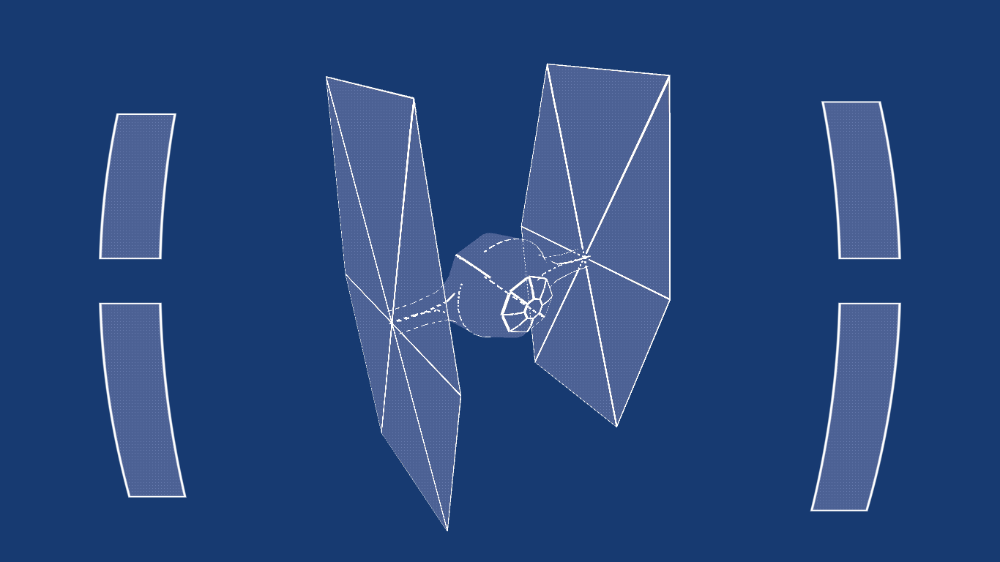

# Experiment 0: TIE fighter dashboard

For this first formal experiment, my goal was to show what a TIE fighter
dashboard could look like (and my personal goal was to learn how to use
Unity's *ShaderLab*). I explain in this document how the effect was created.



## What I wanted to do

The main idea that I had was to display the ship in a kind of wireframe mode
where the lines or sections of lines that are not visible appear as dashed.

## Unity ShaderLab

To create this effect, I wrote my custom shaders with Unity ShaderLab. This
language is a wrapper around HLSL, GLSL or CG code. Though I am more familiar
with GLSL, I chose CG which has the greatest compatibility (Unity cross-compiles
it into HLSL or GLSL anyway).

Unity has a system of surface shaders to let Unity do all the lighting work,
but it is also possible to do a classical vertex-geometry-fragment pipeline,
which I chose to do (I wasn't interested in lighting but needed a geometry
shader as I will explain).

I created two shader programs: one for the ship (vertex-geometry-fragment),
and one for the camera (fragment shader only, with a default vertex shader).

## Creating the spaceship

Creating wireframes is pretty easy, but what was hard in this shader was to
have dashed lines when not visible. It means that I need to render triangles
and not simply lines, and emulate the wireframes. Moreover, I didn't want to
display all the lines but only a few important ones.

To select which lines to display, I used a texture and created the following
rule: if either the red, green or blue component of both ends of a line is close
to 1, this line should be drawn. I needed to use multiple colours because
sometimes two lines of a triangle should be drawn but not the third one. Here
is what the texture looks like:

|Model in Blender|Representation of the UV map|Texture|
|---|---|---|
||||

To draw the lines in the fragment shader, I added information to the vertices
in a geometry shader. The main idea is that each fragment should know its
distance to each line of the triangle, which I implemented with a vector of 3
numbers, each of them with a value of 0 if the vertice is on that line, else
the distance to its projection on the line. I apply the rule described above to
select which lines to draw by adding an important distance to all vertices for
a line that shouldb't be drawn. The fragment shader then uses the distance to
decide if a fragment should be considered in or out of the line.

To apply the dashed effect, I also attach to the vertices, in the geometry
shader, their distance to one extremity of each line, and the length of each
line. Modulo operations can be used in the fragment shader to know which
fragments should always be drawn and which ones should be drawn only when
visible (with a hack to guarantee that the dashes are symmetric, this is
necessary as a line can belong to two triangles and might be in a different
direction in these two). Finally, deciding that some fragments should always be
drawn is done by writing 0 in the depth buffer (the others will be discarded
by the blending operation because something is drawn over them). I tried to do
this operation by customizing the blending operation but the system that allows
to modify isn't really flexible and most blending operators are not supported
in the OpenGL backend (I hope it were possible to write blending shaders but
it's not a thing yet...).

## Creating the dashboard

For this effect, I used a modified fragment position to bend the space and work
with boxes. I defined a function that returns the distance of a point to either
of the shapes (negative if inside, positive if outside). The shapes are
symmetric so I compared the values to a few bounds, and one bound varies
in function of which quarter of the screen the pixel is in, and in function of
time with sines. This function is quite simple overall:

```c
float dist2hud(float2 pos) {
  float2 absPos = abs(pos);
  float time = _Time.y;
  float4 lvls = float4(
    0.37 + dot(float3(0.02, 0.02, 0.01),
               sin(float3(2*time+.5, 3*time + .7, 4*time))),
    0.29 + dot(float3(0.017, 0.009, 0.005),
               sin(float3(1.3*time+.2, 1.9*time + .6, 2.7*time))),
    0.4 + dot(float3(0.02, 0.012, 0.007),
               sin(float3(1.5*time+.2, 2.5*time, 5*time))),
    0.34 + dot(float3(0.025, 0.015, 0.009),
               sin(float3(1.9*time+.5, 3.5*time + .4, 3.7*time))));
  int whichlvl = 2. * (sign(pos.x)/2. + 0.5) + sign(pos.y)/2. + 0.5;
  float xDist = max(0.34 - absPos.x, absPos.x - 0.4);
  float yDist = max(0.04 - absPos.y, absPos.y - lvls[whichlvl]);
  return max(xDist, yDist);
}
```

## Conclusion

This is my first shader in Unity but certainly not the last one! Looking
forward to the next experiment, I'll try to find something cool.

You can check [the release](https://github.com/Nyrio/graphics-experiments/releases) if you want to see the shader in action! :)
