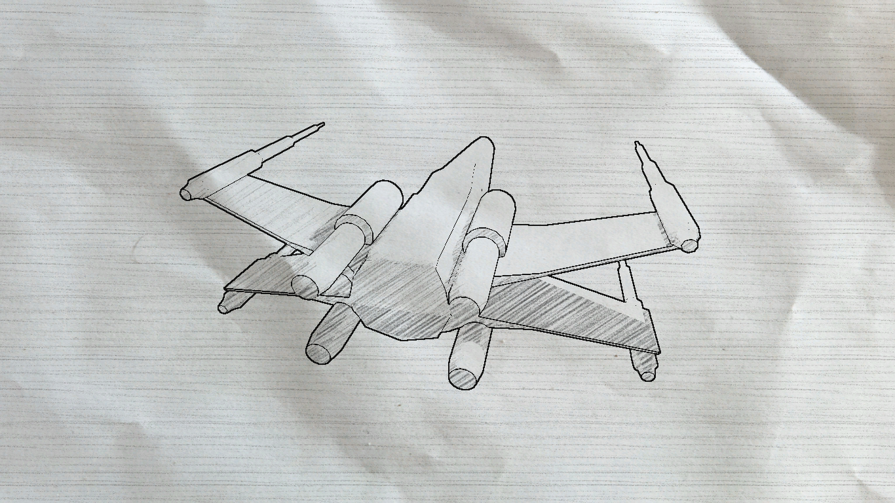
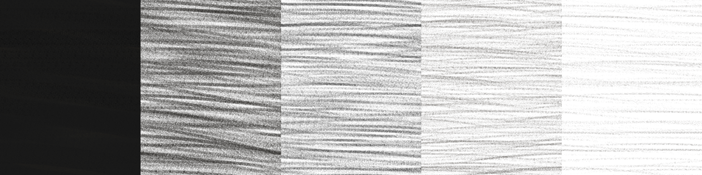

# Experiment 1: sketch of a X-Wing

For this second experiment, my goal was to create a sketch/drawing effect.
To illustrate it I created a model of a X-Wing on Blender. I explain in this
document how the effect was created.



## Creating the line art

For the line art, I perform an edge detection in the camera's pixel shader. It
was a bit tricky to figure out how to get the depth and the normals, but it
turns out that by using the following instructions in the camera's
initialization function, Unity creates a texture `_CameraDepthNormalsTexture`:
accessible in the shader.

```cs
GetComponent<Camera>().depthTextureMode = DepthTextureMode.DepthNormals;
```

I then perform a convolution on the depth and normal components with the
following kernel to get their gradients:

```c
-1 -1 -1
-1  8 -1
-1 -1 -1
```

Finally I use a linear combination of the norms of these gradients to decide if
the pixel belongs to a line or not. The coefficients are empirical, it was a
bit hard to calibrate because my low-poly was too simple so it was hard to
hide the unwanted edges while displaying the wanted ones (I could have used the
normal map to smoothen the normals but there are other issues with that too).

## Creating the strokes

This effect is quite simple: I get the lighting from the texture rendered by
the camera, I flatten that to 6 levels of gray, and sample from a texture that
I created by hand and contains strokes with different densities (see texture
below). The texture repeats itself, and I apply a rotation based on the depth
so that the strokes on the background and the object have a different angle.



Finally, I blend it with a paper texture (the only asset that I didn't create,
found on [textures.com](https://www.textures.com/)).

## Conclusion

Interesting effect and suprisingly not so hard to implement, though getting the
edge detection right can be a bit challenging.

You can check the release if you want to see the shader in action! :)
