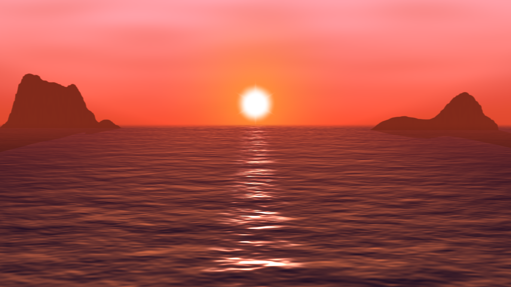

# Experiment 2: sunset on the sea

For this third experiment, my goal was to create a photorealistic sunset scene.
Sunsets on the sea are beautiful, and it was an interesting challenge to render
that in real time.



## Rendering the sea

At first I had the idea of using a grid and displacing the vertices vertically.
Obviously, even with a lot of vertices you would see triangular patterns so I
knew I had to calculate the normals in the fragment shader. And after doing that
I noticed that there was no need for a grid at all, so I switched to using a
single plane and saw no difference at all. In the end there is no displacement,
just a calculation of the right normals.

To calculate these normals, I have a height function that calculates the height
based on the world position. It is a combination of sines and 3 levels of
simplex noise. The noise varies in space and time in a way that simulates the
movement of the waves and their deformation in time:

```c++
float height(float x, float z, float time) {
  return 0.03 * (0.2 * sin(5*z+0.3*time)
                 + 0.1*simplexNoise(float3(3*x, 10*z + 0.4*time, 0.4*time))      // micro
                 + 0.4*simplexNoise(float3(x, 3.5*z + 0.6*time, 0.2*time))       // medium
                 + 0.6*simplexNoise(float3(0.5*x, 1.5*z + 0.6*time, 0.2*time))); // macro
}
```

Once I have the normals, I calculate the angle at which the ray that comes from
the camera and hits the fragment leaves the fragment. I use it to calculate if
it should reflect the sun or not (and I hardcoded the horizontal condition).
I calculate the reflection of the sky simply based on the normal's z value.

The blur to blend the sea with the sky is done with a simple hack: I fade the
opacity to 0 for high z values.

## Rendering the sky

Well, the sky is only a plane and everything is done in its fragment shader.
It's mostly a combination of gradients, a bit of texturing/clouds with simplex
noise, and then the sun. The sun is a combination of two radial gradients and
an additional radial gradient with a modified distance (smaller at the angles
that are a multiple of pi/6) to simulate the camera.

## The mountains

...are simply 2D sprites with a gaussian blur and a bit of distorted simplex
noise.

The shadows are also 2D sprites, rotated by 90° and transparent.

## Atmospheric scattering

This effect is simulated with an image shader. The pixels are blended with a
uniform red value if darker, according to their depth.

## Conclusion

This scene ends up looking good but it's a lot of hacks, my shaders are not so
modular and would require some refactoring before being used in production.

As always you can check the release if you want to see the shader in action! :)
